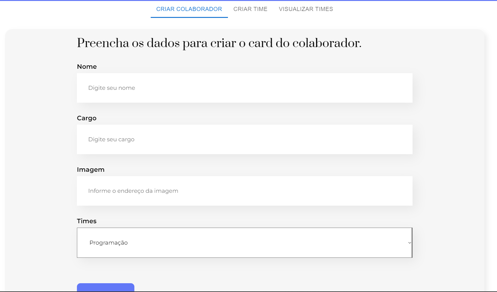
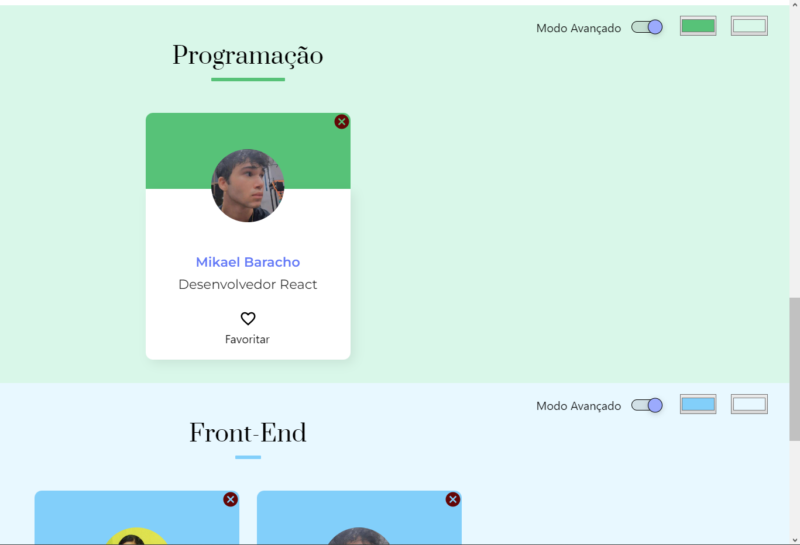

<h1 style="display: block; text-decoration: overline; margin: 0.5em 2em;">React App - Organo Project</h1>

🌟 Organo: Your Ultimate Team Organizer 🌟

📜 Project Description:
Introducing Organo, your go-to team organizer for both company and independent projects! 

🚀 Organo simplifies team collaboration, registration, and management, providing an intuitive and visually appealing platform.

## 🚀 Technologies

This project was developed using the following technologies:

> - React.js
> - HTML and CSS
> - JavaScript
> - Git and Github
> - Figma

## 💻 Project

🔹 Core Features:

📋 Collaborator Registration: Seamlessly onboard new collaborators, providing their names, job titles, and team assignments. Organo keeps your team well-organized.

🎨 Custom Team Colors: Personalize your teams with unique main and background colors. Make each team stand out and create a vibrant workspace.

🔁 Color Mode Switch: Toggle between simple and advanced color modes for precise team color customization.

🗑️ Team Deletion: Need to remove a team? No worries! Deleting a team is a breeze, and Organo takes care of reassigning affected collaborators.

🔄 Real-Time Updates: All changes, from adding collaborators to updating team colors, are reflected in real-time, ensuring a smooth collaborative experience.

🖼️ Collaborator Images with Default Option: Customize profiles with images to enhance recognition and add a personal touch. In case of missing images or errors, Organo gracefully displays a default picture to maintain visual consistency.

🎯 Tabbed Interface: Navigate effortlessly between tabs - create collaborators, manage teams, and visualize your teams' compositions.

🧰 Tech Stack:
Organo is powered by React.js, a versatile JavaScript library for building user interfaces. It also leverages Material-UI components for a polished and responsive design.

🌈 TabsField Component: The app includes a handy TabsField component for easy navigation between key functionalities. Choose between creating collaborators, teams, or viewing your teams' compositions.

🎯 Project Goal:
Organo aims to streamline team organization, encourage collaboration, and enhance the visual appeal of your workspace. It's the perfect tool for managing teams and collaborators effectively, whether you're working on a company project or an independent venture.

🚀 Get Started:
Dive into Organo and experience effortless team collaboration and management. Create, organize, and collaborate with your teams today!

Organo - Where Team Organization Meets Simplicity and Style! 🌟👥🎨

    
    

# Getting Started with Create React App

This project was bootstrapped with [Create React App](https://github.com/facebook/create-react-app).

## Available Scripts

In the project directory, you can run:

### `npm start`

Runs the app in the development mode.\
Open [http://localhost:3000](http://localhost:3000) to view it in your browser.

The page will reload when you make changes.\
You may also see any lint errors in the console.

### `npm test`

Launches the test runner in the interactive watch mode.\
See the section about [running tests](https://facebook.github.io/create-react-app/docs/running-tests) for more information.

### `npm run build`

Builds the app for production to the `build` folder.\
It correctly bundles React in production mode and optimizes the build for the best performance.

The build is minified and the filenames include the hashes.\
Your app is ready to be deployed!

See the section about [deployment](https://facebook.github.io/create-react-app/docs/deployment) for more information.

### `npm run eject`

**Note: this is a one-way operation. Once you `eject`, you can't go back!**

If you aren't satisfied with the build tool and configuration choices, you can `eject` at any time. This command will remove the single build dependency from your project.

Instead, it will copy all the configuration files and the transitive dependencies (webpack, Babel, ESLint, etc) right into your project so you have full control over them. All of the commands except `eject` will still work, but they will point to the copied scripts so you can tweak them. At this point you're on your own.

You don't have to ever use `eject`. The curated feature set is suitable for small and middle deployments, and you shouldn't feel obligated to use this feature. However we understand that this tool wouldn't be useful if you couldn't customize it when you are ready for it.

## Learn More

You can learn more in the [Create React App documentation](https://facebook.github.io/create-react-app/docs/getting-started).

To learn React, check out the [React documentation](https://reactjs.org/).

### Code Splitting

This section has moved here: [https://facebook.github.io/create-react-app/docs/code-splitting](https://facebook.github.io/create-react-app/docs/code-splitting)

### Analyzing the Bundle Size

This section has moved here: [https://facebook.github.io/create-react-app/docs/analyzing-the-bundle-size](https://facebook.github.io/create-react-app/docs/analyzing-the-bundle-size)

### Making a Progressive Web App

This section has moved here: [https://facebook.github.io/create-react-app/docs/making-a-progressive-web-app](https://facebook.github.io/create-react-app/docs/making-a-progressive-web-app)

### Advanced Configuration

This section has moved here: [https://facebook.github.io/create-react-app/docs/advanced-configuration](https://facebook.github.io/create-react-app/docs/advanced-configuration)

### Deployment

This section has moved here: [https://facebook.github.io/create-react-app/docs/deployment](https://facebook.github.io/create-react-app/docs/deployment)

### `npm run build` fails to minify

This section has moved here: [https://facebook.github.io/create-react-app/docs/troubleshooting#npm-run-build-fails-to-minify](https://facebook.github.io/create-react-app/docs/troubleshooting#npm-run-build-fails-to-minify)
